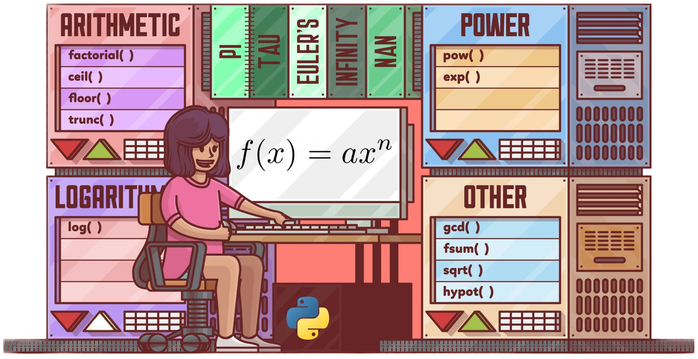

# Computer Programming in Mathematics
09114204 การเขียนโปรแกรมคอมพิวเตอร์ทางคณิตศาสตร์

ผู้สอน: ดร.รัฐพรหม พรหมคำ



## ปีการศึกษา 2/2565
รายวิชานี้ดำเนินการสอนในรูปแบบการบรรยาย ปฏิบัติการทางคอมพิวเตอร์ 
อาจรวมถึงห้องเรียนออนไลน์หรือเป็นไปตามประกาศของทางมหาวิทยาลัยเทคโนโลยีราชมงคลธัญบุรี 

| Section | MS-Teams Invitation Code | Line Open Chat | 
|---------|--------------------------|-----------|
|   01    |           `y4v32u6`      |  [Click to join](https://line.me/ti/g2/p7uQ_jV_3HmC660CYdQvneFJa1SDyBDpW05_WQ?utm_source=invitation&utm_medium=link_copy&utm_campaign=default) |

## เวลาและสถานที่เรียน

| Section | ห้องเรียน | วัน | เวลาบรรยายทฤษฏี  | เวลาปฏิบัติการ  |
|--------|---------|----|---------------|---------------|
| 01     |  ST1905 | จันทร์| 13.00 - 14.00  | 14.00 - 17.00|

สอบกลางภาค: xx มกราคม 2565 เวลา 13.00 - 16.00

สอบปลายภาค: xx มีนาคม 2566 เวลา 13.00 - 16.00


## คำอธิบายรายวิชา
แนวคิดของการโปรแกรมแบบโพรซีเดอรัลและการโปรแกรมเชิงวัตถุด้วยไพธอน ประเภทของข้อมูลเนทีฟ โครงสร้างการควบคุม ฟังก์ชัน คลาส คุณสมบัติและวิธีการของคลาส การสืบทอด แฟ้ม การรับมือข้อผิดพลาดและข้อยกเว้น การทดสอบโปรแกรม การแก้ไขข้อผิดพลาดของโปรแกรม ไลบราลีด้านคณิตศาสตร์ เช่น นัมไพ แพนดาส และ แม็ทพลอทลิบ

Concepts of procedural and object-oriented programmings with Python, native data types, control structures, functions, classes, properties and methods of classes, inheritance, files, error and exception handling, testing, debugging, mathematics libraries like Numpy, pandas and matplotlib


## จุดมุ่งหมายรายวิชา
1. นักศึกษาเข้าใจแนวคิดในการเขียนโปรแกรมคอมพิวเตอร์แบบโพรซีเดอรัลด้วยภาษาโปรแกรมไพธอน
2. นักศึกษาเข้าใจแนวคิดในการเขียนโปรแกรมคอมพิวเตอร์เชิงวัตถุด้วยภาษาโปรแกรมไพธอน
3. นักศึกษาทราบกระบวนการพัฒนาโปรแกรมคอมพิวเตอร์ทางคณิตศาสตร์
4. นักศึกษารับมือข้อผิดพลาดในโปรแกรมคอมพิวเตอร์ที่พัฒนาขึ้นมาได้อย่างเหมาะสม
5. นักศึกษารู้จักไลบรารีด้านคณิตศาสตร์ที่เป็นที่นิยมในปัจจุบัน
6. นักศึกษาประยุกต์ใช้ไลบรารีด้านคณิตศาสตร์ในการแก้ปัญหาที่สนใจ

## หัวข้อการบรรยาย

|Week|        | หัวข้อ | เอกสารประกอบการบรรยาย/ปฏิบัติการ |
|----|--------| -----|----------------------------|
| 1-2   | A1  | Review of Procedural Programming in Python <br> ทบทวนพื้นฐานที่จำเป็น ในการเขียนโปรแกรมคอมพิวเตอร์แบบโพรซีเดอรัลด้วยภาษาโปรแกรมไพธอน |  [Download](./materials/a1.zip) |
| 3-4 | B1 | Introduction to Object Oriented Programming <br> แนะนำการเขียนโปรแกรมคอมพิวเตอร์เชิงวัตถุด้วยภาษาโปรแกรมไพธอน |  |  
| 5   | B2 | Handling of Errors and Exceptions <br> รับมือกับข้อผิดพลาด และแก้ไขข้อผิดพลาดในการเขียนโปรแกรมคอมพิวเตอร์ | | 
| 6   | B3| Reading and Writing Files <br> เขียนโปรแกรมคอมพิวเตอร์เพื่อการอ่านและบันทึกไฟล์  | |
| 7   | B4 | Code Testing in Python <br> ทดสอบความถูกต้องของชุดคำสั่งในโปรแกรมคอมพิวเตอร์ทั้งแบบปกติและการใช้เฟรมเวิร์ก| |
| 8   | C1 | Python GUI Programming <br> เขียนส่วนติดต่อผู้ใช้แบบกราฟฟิกให้กับโปรแกรมคอมพิวเตอร์| |
| 9   |    |  การสอบกลางภาค   |  |
| 10-11  | C2 | Array and Vectorized Computation <br> แนะนำการใช้แพคเกจ numpy สำหรับการทำงานด้านอาเรย์หลายมิติ และการคำนวณแบบเวกเตอร์ | |
| 12-13 | C3 | Working with Dataframe <br> แนะนำการใช้แพคเกจ pandas สำหรับการทำงานกับเฟรมข้อมูล | |
| 14-15 | C4 | Ploting and Visualization <br> แนะนำการใช้แพคเกจสำหรับการวาดกราฟ และ แผนภาพแบบต่าง ๆ | |
| 16    |    |  การนำเสนอโครงงาน  |  |
| 17    |    |  การสอบปลายภาค |  |

## การวัดผลการเรียน
คะแนนเต็ม 100 คะแนน โดยแบ่งออกเป็น
- การสอบกลางภาค 25%
- การสอบปลายภาค 25%
- งานที่ได้รับมอบหมาย 25%
- โครงงาน 25%

หากนักศึกษาเข้าเรียนน้อยกว่า 80% ของเวลาเรียนทั้งหมด
หรือได้คะแนนรวมน้อยกว่า 50% ของคะแนนเต็ม นักศึกษาจะไม่ผ่านในรายวิชานี้ และได้รับการบันทึกผลการเรียน F (เกรด 0.0) 

สำหรับนักศึกษาที่ผ่านเกณฑ์ดังกล่าว จะได้รับการบันทึกผลการเรียนตามเกณฑ์ของคะแนน t-score 

```
t-score = 50 + 10*(x - u)/s
```
เมื่อ x คือคะแนนรวม, u คือคะแนนเฉลี่ยของคะแนนรวม และ s คือส่วนเบี่ยงเบนมาตรฐานของคะแนนรวม

ดังนี้

| ผลการเรียน | เกรด | เกณฑ์ t-score |
|---------|------|--------------|
| F | 0.00 | (-Inf, 50) | 
| D | 1.00 | [50, 55) | 
| D+ | 1.50 | [55, 60) | 
| C | 2.00 | [60, 65) |
| C+ | 2.50 | [65, 70) |
| B | 3.00 | [70, 75) |
| B+ | 3.50 | [75, 80) |
| A | 4.00 | [80, Inf) |

## เอกสารอ้างอิง
- Mark Lutz. [Learning Python](https://www.amazon.com/Learning-Python-5th-Mark-Lutz/dp/1449355730), 5th Edition. O'Reilly Media, Inc. (2013).
- Wes McKinney. [Python for Data Analysis: Data Wrangling with Pandas, NumPy, and IPython](https://www.amazon.com/Python-Data-Analysis-Wrangling-IPython/dp/1491957662
). O'Reilly Media, Inc. (2018)